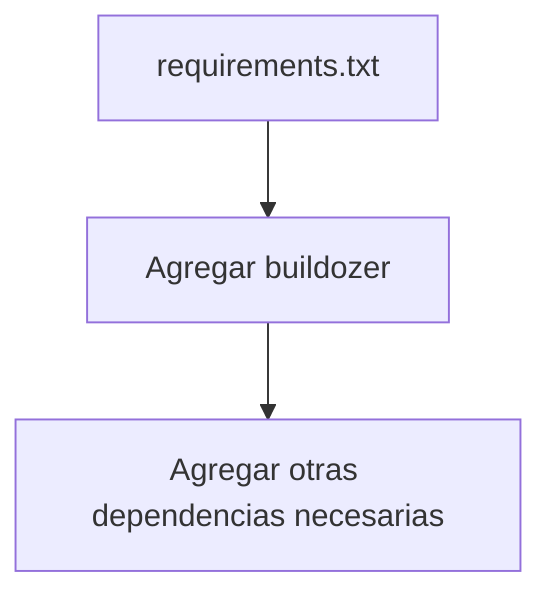
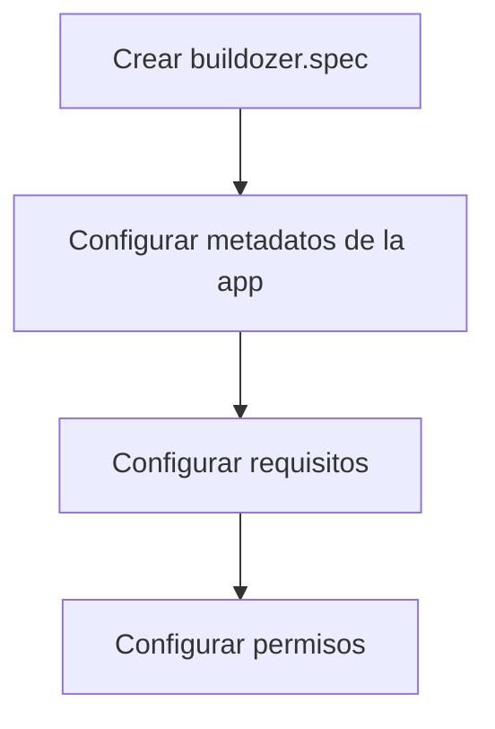

# Plan de Construcción de APK

## Problemas Identificados
1. No existe un archivo buildozer.spec necesario para la construcción
2. El comando `flet pack` está fallando debido a una configuración inadecuada
3. Faltan dependencias necesarias en requirements.txt

## Solución Propuesta

### 1. Actualizar requirements.txt
- Agregar buildozer como dependencia
- Incluir otras dependencias necesarias para la construcción

### 2. Crear archivo buildozer.spec
- Configurar metadatos de la aplicación (nombre, versión, etc.)
- Configurar requisitos de construcción
- Establecer permisos necesarios

### 3. Modificar el workflow
- Instalar dependencias del sistema necesarias
- Configurar buildozer correctamente
- Implementar proceso de construcción del APK
- Configurar el almacenamiento del artefacto generado

## Pasos de Implementación
1. Crear buildozer.spec con la configuración básica para la aplicación
2. Actualizar requirements.txt para incluir todas las dependencias
3. Modificar el archivo de workflow para soportar la construcción con buildozer
4. Implementar la generación del APK usando buildozer directamente

## Diagramas





```mermaid
graph TD
    A[Modificar build-apk.yml] --> B[Instalar dependencias del sistema]
    B --> C[Configurar buildozer]
    C --> D[Construir APK]
    D --> E[Subir artefacto]